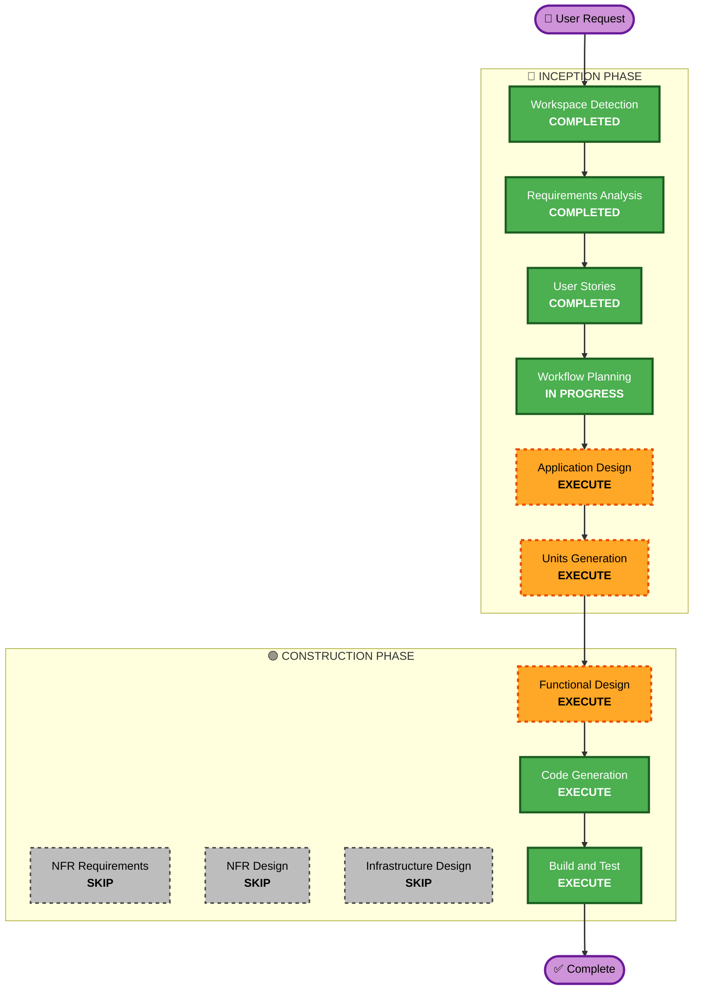

# Execution Plan

## Detailed Analysis Summary

### Project Overview
- **Project Type**: Greenfield (새 프로젝트)
- **Application**: 테이블오더 서비스 (디지털 주문 시스템)
- **Tech Stack**: Node.js + Express, React (TypeScript), PostgreSQL, SSE
- **Structure**: Monorepo (Frontend + Backend)
- **Team Size**: 3명 (풀스택 기능 단위 병렬 개발)

### Change Impact Assessment
- **User-facing changes**: Yes - 고객 주문 UI + 관리자 대시보드 (신규 구축)
- **Structural changes**: Yes - 전체 시스템 아키텍처 설계 필요
- **Data model changes**: Yes - 9개 핵심 엔티티 (Store, Table, Session, Category, Menu, Order, OrderItem, Admin, OrderHistory)
- **API changes**: Yes - 고객용 5개 + 관리자용 9개 API 엔드포인트
- **NFR impact**: Yes - 실시간 SSE (2초 이내), 터치 친화적 UI, 세션 관리

### Risk Assessment
- **Risk Level**: Medium
- **Rollback Complexity**: Easy (Greenfield - 롤백 불필요)
- **Testing Complexity**: Moderate (SSE 실시간 통신, 세션 관리 테스트 필요)

---

## Workflow Visualization



### Text Alternative
```
Phase 1: INCEPTION
  - Workspace Detection     [COMPLETED]
  - Requirements Analysis   [COMPLETED]
  - User Stories            [COMPLETED]
  - Workflow Planning       [IN PROGRESS]
  - Application Design     [EXECUTE]
  - Units Generation       [EXECUTE]

Phase 2: CONSTRUCTION (Per-Unit Loop)
  - Functional Design      [EXECUTE]
  - NFR Requirements       [SKIP]
  - NFR Design             [SKIP]
  - Infrastructure Design  [SKIP]
  - Code Generation        [EXECUTE]
  - Build and Test         [EXECUTE]

Phase 3: OPERATIONS
  - Operations             [PLACEHOLDER]
```

---

## Phases to Execute

### 🔵 INCEPTION PHASE
- [x] Workspace Detection (COMPLETED)
- [x] Requirements Analysis (COMPLETED)
- [x] User Stories (COMPLETED - 17 stories, 2 personas)
- [x] Workflow Planning (IN PROGRESS)
- [ ] Application Design - **EXECUTE**
  - **Rationale**: 새 시스템의 컴포넌트, 서비스 레이어, 의존성 설계 필요. Backend/Frontend 컴포넌트 식별, 메서드 시그니처, 서비스 오케스트레이션 패턴 정의 필수.
- [ ] Units Generation - **EXECUTE**
  - **Rationale**: 다중 컴포넌트 시스템(Frontend, Backend, Database)으로 구조적 분해 필요. 3명 팀의 병렬 작업을 위한 단위 분할 필수.

### 🟢 CONSTRUCTION PHASE
- [ ] Functional Design - **EXECUTE** (per-unit)
  - **Rationale**: 9개 데이터 모델, 복잡한 비즈니스 로직(주문 흐름, 세션 관리, 상태 전이), API 설계가 필요.
- [ ] NFR Requirements - **SKIP**
  - **Rationale**: 요구사항에서 이미 NFR이 명확히 정의됨 (SSE 2초, 터치 44px, 세션 유지). Security/PBT extension도 비활성화. 별도 NFR 분석 불필요.
- [ ] NFR Design - **SKIP**
  - **Rationale**: NFR Requirements가 스킵되므로 NFR Design도 불필요. NFR 패턴은 Functional Design에서 자연스럽게 반영.
- [ ] Infrastructure Design - **SKIP**
  - **Rationale**: MVP 단계에서 AWS 배포 상세 설계는 불필요. 로컬 개발 환경 우선, 배포는 Build and Test 이후 별도 진행 가능.
- [ ] Code Generation - **EXECUTE** (ALWAYS, per-unit)
  - **Rationale**: 실제 코드 구현 필수.
- [ ] Build and Test - **EXECUTE** (ALWAYS)
  - **Rationale**: 빌드 및 테스트 검증 필수.

### 🟡 OPERATIONS PHASE
- [ ] Operations - PLACEHOLDER
  - **Rationale**: 향후 배포/모니터링 워크플로우 확장 예정.

---

## Estimated Timeline
- **Total Stages to Execute**: 5 (Application Design, Units Generation, Functional Design, Code Generation, Build and Test)
- **Total Stages to Skip**: 3 (NFR Requirements, NFR Design, Infrastructure Design)

## Success Criteria
- **Primary Goal**: 단일 매장 테이블오더 MVP 완성
- **Key Deliverables**:
  - 고객용 주문 UI (메뉴 탐색, 장바구니, 주문)
  - 관리자용 대시보드 (실시간 주문 모니터링, 메뉴/테이블 관리)
  - Backend API (인증, 주문, 메뉴, SSE)
  - PostgreSQL 데이터베이스 스키마
- **Quality Gates**:
  - 모든 API 엔드포인트 동작 확인
  - SSE 실시간 주문 알림 2초 이내
  - 터치 친화적 UI (44x44px 최소 터치 영역)
  - 세션 기반 주문 격리 동작 확인
